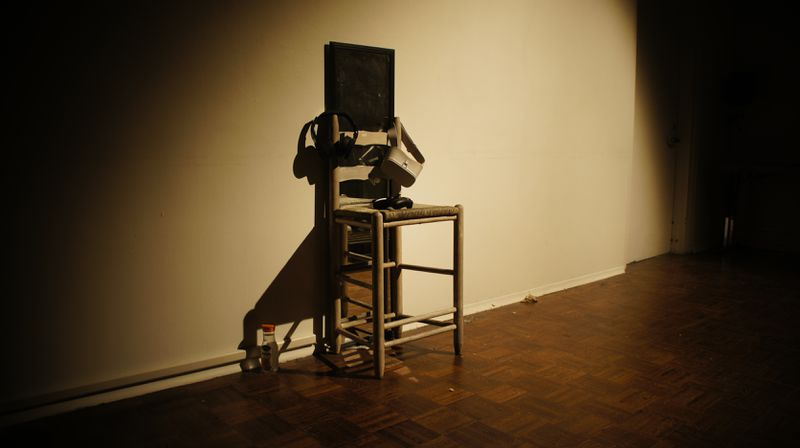

# [Ai.io](https://docs.google.com/presentation/d/1x5YmjVEOcX7ScG8wZfZPJEBp855fR3iHho3X8f6jBgo/edit#slide=id.p)

An exploration of Artificial Intelligence & Transhumanism. A digital installation project created for [ART 4848C](http://art-tech.arts.ufl.edu/~jack/wiki/S17-Installation). You can find a project proposal [here](https://docs.google.com/presentation/d/1x5YmjVEOcX7ScG8wZfZPJEBp855fR3iHho3X8f6jBgo/edit#slide=id.p).

## Technology Stack
- [Unity](https://unity3d.com/)
- [Api.ai](https://api.ai/)

#### Documentation

